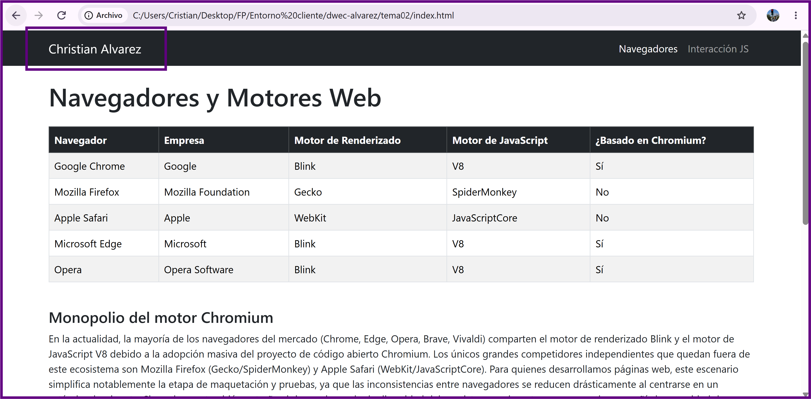
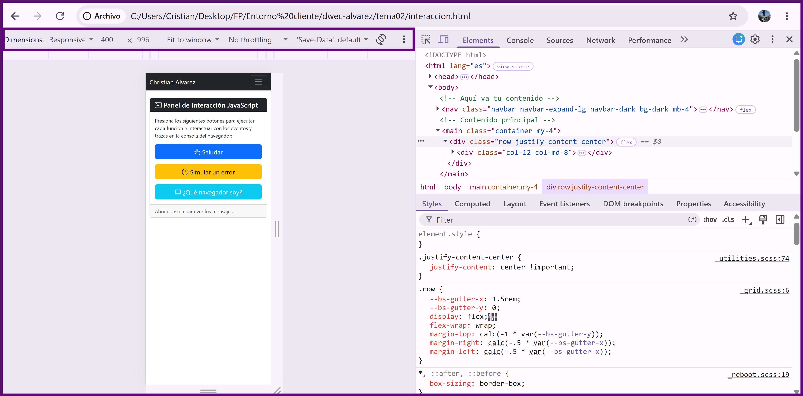
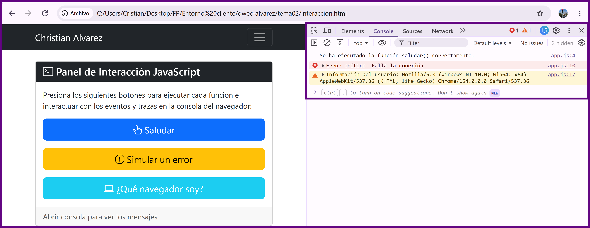
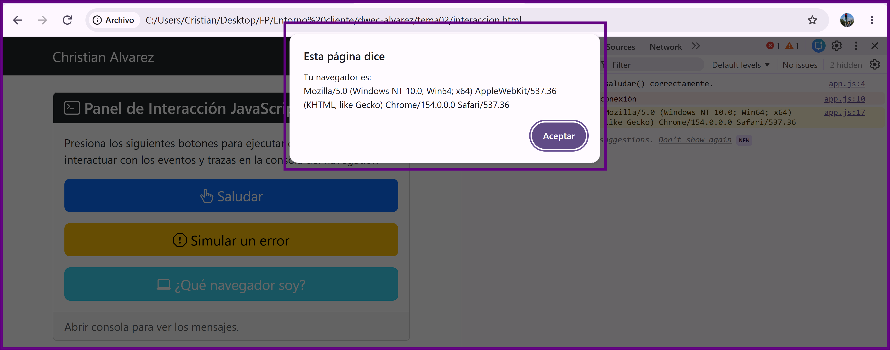
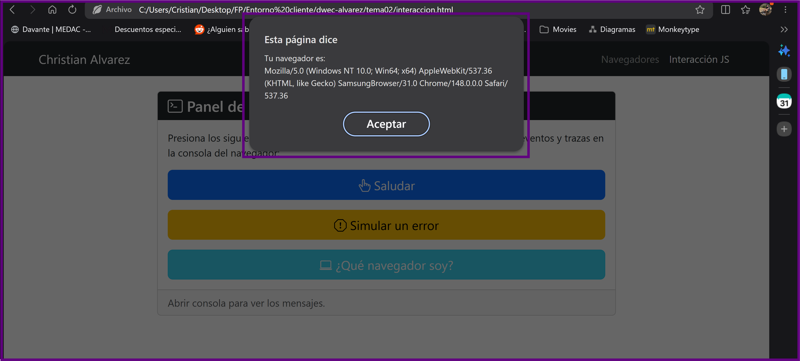
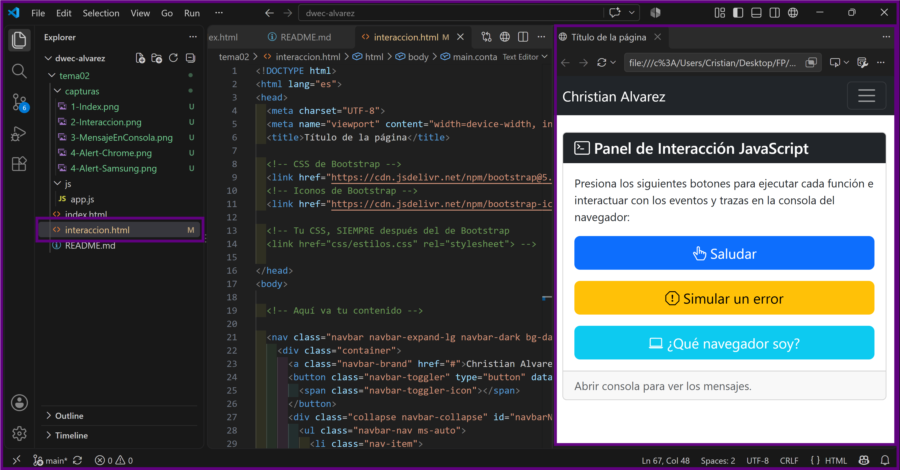

# Tarea 2: Navegadores, motores y primera página interactiva
**Asignatura:** Desarrollo Web en Entorno Cliente  
**Alumno:** Christian Alvarez

---

## 1. Evidencias de funcionamiento (Capturas)

### Captura 1: Visualización de `index.html` en el ordenador
  
*Vista general de la página de navegadores en pantalla donde se aprecia la barra de navegación con mi nombre y apellidos.*

### Captura 2: Visualización de `interaccion.html` en vista de dispositivo móvil
  
*Comprobación de la respuesta responsive de la interfaz simulando la resolución de un dispositivo móvil en consola.*

### Captura 3: Trazas de la consola tras la interacción
  
*En la consola web se demuestra el registro de trazas tipo log, warn y error al pinchar en los botones correspondientes.*

### Captura 4: Ejecución de `navigator.userAgent` en navegadores distintos

  
*Se visualiza la ventana modal emergente alert() reflejada en Chrome y Samsung mostrando la cadena navigator.userAgent.*

### Captura 5: Entorno VS Code con Live Server activo
  
*Espacio de trabajo en Visual Studio Code con la estructura de directorios del proyecto y la extensión Live Server activa.*

---

## 2. Explicación de como funciona la aplicacion:

Para la interacción en el botón **"Saludar"**:

* **HTML (`interaccion.html`):** Define la estructura mediante el elemento `<button>`. Se establece el texto visible para la interacción y utiliza el atributo `onclick="saludar()"` para vincular la acción del usuario con el JavaScript.
* **CSS / Bootstrap:** Aporta las reglas de formato, márgenes y diseño visual a través de las clases predefinidas de Bootstrap (`btn btn-primary btn-lg`).
* **JavaScript (`js/app.js`):** Controla el comportamiento de lo que pasa en la pagina. Al ejecutar la función `saludar()`, la pantalla se pausa  mediante `alert()` para mostrar un mensaje flotante y se registra de manera descriptiva con `console.log()` en las herramientas de desarrollo.

---

## 3. Comparativa y análisis del `userAgent`

Al ejecutar la cadena `navigator.userAgent`, se obtienen valores similares a los siguientes:

* **En Google Chrome / Edge:**  
  `Mozilla/5.0 (Windows NT 10.0; Win64; x64) AppleWebKit/537.36 (KHTML, like Gecko) Chrome/128.0.0.0 Safari/537.36`
* **En Mozilla Firefox:**  
  `Mozilla/5.0 (Windows NT 10.0; Win64; x64; rv:129.0) Gecko/20100101 Firefox/129.0`

### ¿Por qué aparecen términos como `Mozilla`, `AppleWebKit` o `Safari` aunque no se utilicen esos navegadores?
Porque los navegadores añadieron palabras clave de sus competidores a su propia cadena identificadora para evitar ser bloqueados por servidores web antiguos que restringían el acceso únicamente a ciertos clientes. `AppleWebKit` y `Safari` se mantienen en la cadena de los navegadores basados en Chromium para notificar al servidor que el cliente soporta el renderizado moderno derivado de dicho código base.

---

## 4. Fuentes consultadas y declaración de IA

### Fuentes consultadas
1. **MDN Web Docs - Navigator.userAgent:** [https://developer.mozilla.org/es/docs/Web/API/Navigator/userAgent](https://developer.mozilla.org/es/docs/Web/API/Navigator/userAgent)
2. **Bootstrap 5.3 Documentation:** [https://getbootstrap.com/docs/5.3/getting-started/introduction/](https://getbootstrap.com/docs/5.3/getting-started/introduction/)
3. **Can I use... (Tables for HTML5, CSS3, etc.):** [https://caniuse.com/](https://caniuse.com/)

### Uso de IA
* **Herramienta utilizada:** Gemini.
* **Propósito:** Ayuda en la creación de la estructura del maquetado HTML, guia inicial de tablas y plantillas base adaptadas a Bootstrap.
* **Acciones posteriores:** Ajuste manual de los textos, inclusión de datos personales en los componentes y verificación de ausencia de errores sintácticos mediante ejecución local con Live Server.