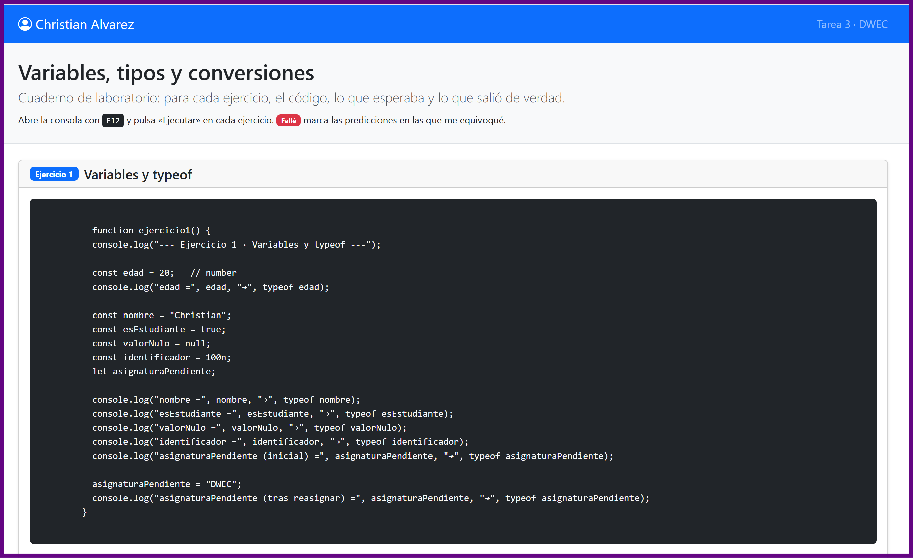
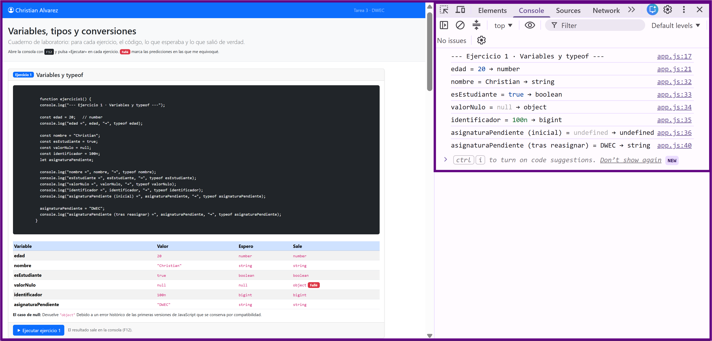
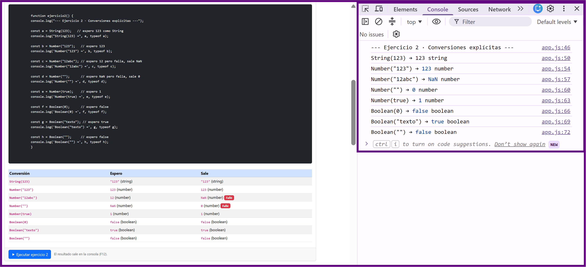
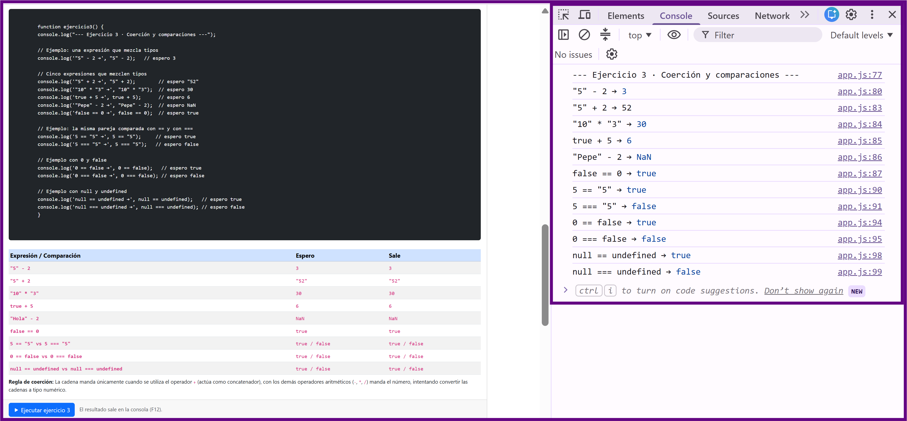
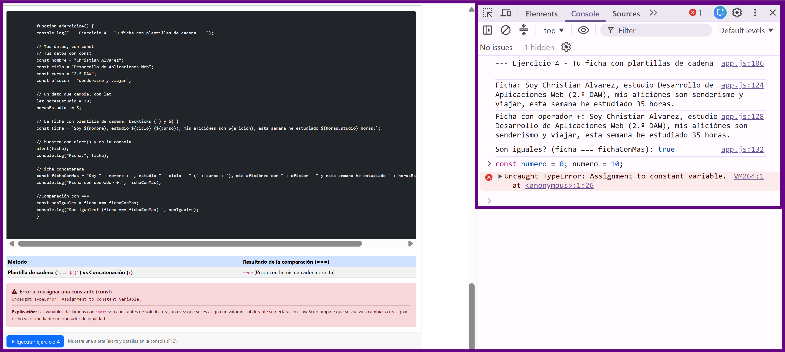

# Tarea 3 · Variables, tipos y conversiones

**Autor:** Christian Alvarez · Desarrollo Web en Entorno Cliente (DWEC) · 2.º DAW · Curso 2026-27

<!-- **Plantilla de la tarea 3.** Cómo usarla:
>
> 1. Copia esta carpeta en tu repositorio de DWEC y cámbiale el nombre a `tema03`.
> 2. `index.html` trae la card del ejercicio 1 como modelo: cópiala para los ejercicios 2, 3 y 4.
> 3. `js/app.js` trae una función por ejercicio: escribe tu código donde pone `TODO`.
> 4. Sustituye las imágenes de `capturas/` por las tuyas, **con el mismo nombre**.
> 5. Todo lo que va entre [corchetes] es un hueco: cámbialo por lo tuyo. Al terminar, borra este aviso. -->

Para ver esta tarea en funcionamiento, ejecuta el html en el navegador, abre la consola del navegador con <kbd>F12</kbd> y haz clic en el botón «Ejecutar» de cada ejercicio.

## Capturas

### a) La página entera

Se observa la página maquetada con Bootstrap, mi nombre en la navbar, las cuatro cards completas con sus tablas y los badges marcando los fallos de predicción.

### b) Consola del ejercicio 1

Muestra el valor y el tipo de dato (`typeof`) de seis variables distintas, incluyendo el caso especial de `null` y la reasignación de una variable `let`.

### c) Consola del ejercicio 2

Muestra los resultados de las conversiones explícitas obligatorias con `Number()`, `String()` y `Boolean()`, destacando valores como `NaN` y `0`.

### d) Consola del ejercicio 3

Muestra la evaluación de expresiones con coerción implícita y la comparación de tres parejas de valores utilizando igualdad débil (`==`) e igualdad estricta (`===`).

### e) Consola del ejercicio 4, con el error de la const

Muestra la salida del mensaje en *Pop up y consola*, la comprobación de igualdad estricta y el error `TypeError` provocado al intentar reasignar una constante.

## Reflexión

Las conversiones explícitas como `String(123)`, `Number("123")` o `Boolean("texto")` resultaron muy intuitivas porque siguen la lógica directa de transformación de datos, algunas conversiones implícitas y explícitas me han llamado la atencion. Por ejemplo, `Number("12abc")` devuelve `NaN` al no poder convertir la cadena completa, mientras que `Number("")` devuelve `0` por JavaScript. Asimismo me llamó la atención que `typeof null` devuelva `"object"` por un error histórico de implementación. En cuanto a las comparaciones, comprobar que `"5" + 2` produce `"52"` por concatenación mientras que `"5" - 2` da `3` por coerción numérica demuestra por qué es fundamental utilizar siempre el operador de igualdad estricta (`===`) para evitar fallos inesperados en el código.

## Fuentes

- [MDN Web Docs - JavaScript data types and data structures](https://developer.mozilla.org/es/docs/Web/JavaScript/Data_structures)
- [MDN Web Docs - typeof](https://developer.mozilla.org/es/docs/Web/JavaScript/Reference/Operators/typeof)
- [MDN Web Docs - Template literals](https://developer.mozilla.org/es/docs/Web/JavaScript/Reference/Template_literals)

## Uso de IA

Se ha utilizado un asistente de Inteligencia Artificial (Gemini) para orientar la estructura del proyecto y revisar las explicaciones conceptuales de la tarea, despues he escrito y comprobado personalmente el código, verificando los resultados de las tablas.
